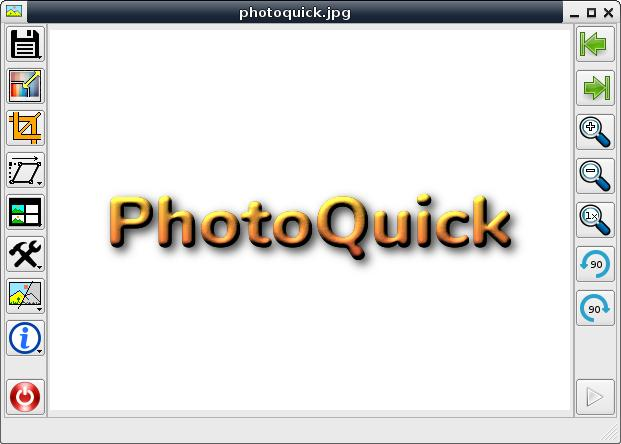
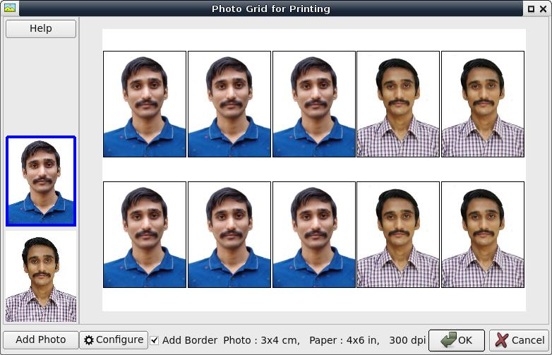
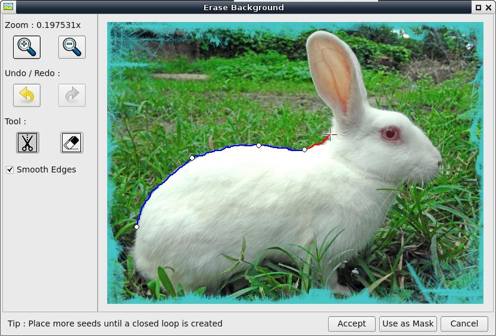

# PhotoQuick (for Linux and Windows)
A simple handy image viewer and editor with some useful features (Qt based).

### Description
This program is aimed at ease of use, quick opening, and doing most necessary features.  

 * Export to PDF  
 * Auto Resize to file size  
 * Crop in particular ratio  
 * Rotate, mirror, perspective transform  
 * Add Border  
 * Create photo grid for printing  
 * Magic Eraser (inpainting)  
 * Intelligent Scissor  
 * Filters  (Scan Page, Reduce Noise, Auto Contrast, White Balance )  
 * Photo Optimizer & Batch Resize  
 * Plugin support  


### Download
Download the precompiled packages from [releases page](https://github.com/ksharindam/photoquick/releases).  
For Windows download .exe package and install it.  
For Linux download .AppImage package, mark it executable, and double click to run.  

### Build (Linux)

Install dependencies...  
**Build dependencies ...**  
 * qtbase5-dev  
 * build-essential  

To build this program, extract the source code zip.  
Open terminal and change directory to src/  
Then run these commands to compile...  
```
qmake  
make -j4  
```

To install run ...  
`sudo make install`  

To uninstall, run ...  
`sudo make uninstall`  

**Runtime Dependencies**  
* libqt5core5a  
* libqt5gui5  
* libqt5svg5  (for svg support | optional)  
* libgomp1  
* wget (for check for updates in linux | optional)  


### Plugins
The plugins/ directory contains only sample plugins.  
Get full set of plugins [here](https://github.com/ksharindam/photoquick-plugins)  

**Build (Linux and Windows) :**  
Open terminal or command line in project root directory.  
Then run these commands to compile...  
```
cd plugins  
qmake  
make -j4  
```  
**Install (Linux) :**  
`sudo make install`  

Get more plugins from https://github.com/ImageProcessing-ElectronicPublications/photoquick-plugins  
Also you can create your own plugins and use with it.  

### Usage
To run this program...  
`photoquick`  

To open image.jpg with it...  
`photoquick image.jpg`  

### Keyboard Shortcuts
Reload Image : R  
Delete Image : Delete  
Copy Image : Ctrl+C  
Undo : Ctrl+Z  
Redo : Ctrl+Y  

### Supported Image Formats
All formats supported by Qt are supported in this program.  
**Read & Write :** JPG, PNG, GIF, ICO, WEBP  
**Read Only :** SVG  

install qt5-image-formats-plugins and kimageformat-plugins to get may other formats support like avif, heif, psd.  


### Screenshots

Main Window  
  

Photo-Grid  
  

Scissor Tool  
  

